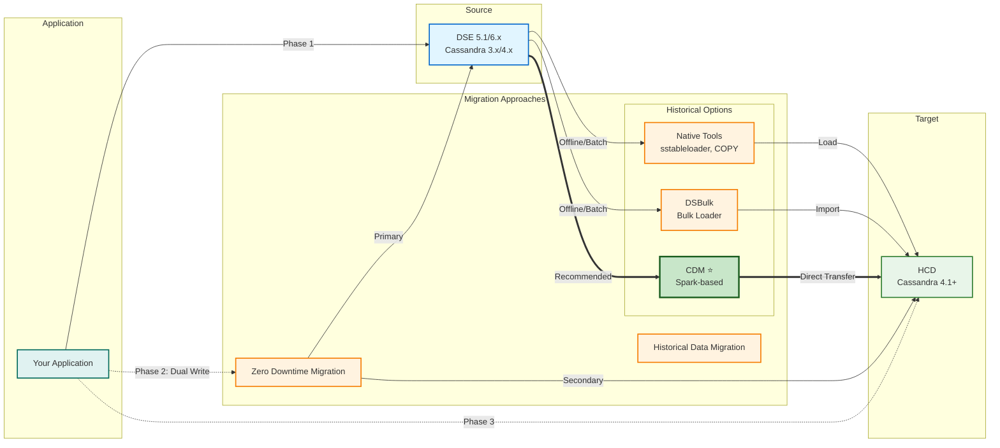

# Cassandra/DataStax Enterprise to HCD Zero-Downtime Migration Training

## Overview

This comprehensive training covers data migration strategies from DataStax Enterprise (DSE) 5.1 to Hyper-Converged Database (HCD) with zero downtime. The training includes theoretical concepts, practical tools comparison, and hands-on lab exercises.

## Migration Architecture



### Migration Strategy Overview

**Historical Data Migration** (One-time bulk transfer)
- **Native Tools**: Basic sstableloader and COPY commands for small datasets
- **DSBulk**: DataStax Bulk Loader for medium-sized datasets with better performance
- **CDM** ⭐: Cassandra Data Migrator (Spark-based) - **Recommended** for production migrations

**Zero Downtime Migration** (Live traffic cutover)
- **ZDM Proxy**: Transparent proxy enabling dual-writes and gradual traffic cutover
- Supports phased migration: Direct → Proxy (dual-write) → Target

**Typical Migration Flow**:
1. Migrate historical data using CDM (offline/batch)
2. Deploy ZDM Proxy for new writes (dual-write mode)
3. Validate data consistency
4. Gradually cutover reads to target
5. Decommission source cluster

## Training Structure

### 1. Theory & Strategy
- [`docs/01-migration-overview.md`](docs/01-migration-overview.md) - Migration fundamentals and planning
- [`docs/02-native-tooling.md`](docs/02-native-tooling.md) - Native Cassandra/DSE tools
- [`docs/03-dse-tooling.md`](docs/03-dse-tooling.md) - DSE-specific migration tools
- [`docs/04-zdm-approach.md`](docs/04-zdm-approach.md) - Zero Downtime Migration proxy
- [`docs/05-cdm-approach.md`](docs/05-cdm-approach.md) - Cassandra Data Migrator
- [`docs/06-comparison-matrix.md`](docs/06-comparison-matrix.md) - Tool comparison and decision guide
- [`docs/07-challenges-risks.md`](docs/07-challenges-risks.md) - Challenges, risks, and mitigation

### 2. Hands-On Lab
- [`lab/README.md`](lab/README.md) - Lab setup and exercises
- [`lab/docker-compose.yml`](lab/docker-compose.yml) - Lab environment configuration
- [`lab/exercises/`](lab/exercises/) - Step-by-step lab exercises

## Prerequisites

- Docker Desktop or Colima installed
- Basic understanding of Cassandra/DSE architecture
- Familiarity with CQL (Cassandra Query Language)
- Command-line proficiency

## Quick Start

### Using Colima on Apple Silicon (M1/M2/M3)

```bash
# Start Colima with Rosetta 2 for full compatibility
colima start --arch aarch64 --vm-type=vz --vz-rosetta --cpu 6 --memory 12 --disk 60

# Navigate to lab directory
cd lab

# Start the lab environment
docker-compose up -d

# Verify containers are running
docker-compose ps
```

**Note**: Rosetta 2 is required for ZDM Proxy on Apple Silicon. See [`lab/ARM64-NOTES.md`](lab/ARM64-NOTES.md) for details.

### Using Colima on Intel/AMD (x86_64)

```bash
# Start Colima with sufficient resources
colima start --cpu 4 --memory 8 --disk 50

# Navigate to lab directory
cd lab

# Start the lab environment
docker-compose up -d

# Verify containers are running
docker-compose ps
```

### Using Docker Desktop

```bash
# Navigate to lab directory
cd lab

# Start the lab environment
docker-compose up -d

# Verify containers are running
docker-compose ps
```

## Training Path

1. **Read Documentation** (2-3 hours)
   - Start with migration overview
   - Review each tooling approach
   - Study the comparison matrix
   - Understand challenges and risks

2. **Complete Lab Exercises** (3-4 hours)
   - Exercise 1: Environment setup and validation
   - Exercise 2: Native tooling migration
   - Exercise 3: ZDM proxy migration
   - Exercise 4: CDM migration
   - Exercise 5: Comparison and best practices

3. **Review and Practice** (1-2 hours)
   - Troubleshooting scenarios
   - Performance tuning
   - Production readiness checklist

## Key Learning Objectives

By completing this training, you will:

- ✅ Understand Cassandra/DSE to HCD migration fundamentals
- ✅ Evaluate and select appropriate migration tools
- ✅ Implement zero-downtime migration strategies
- ✅ Identify and mitigate migration risks
- ✅ Handle common migration challenges
- ✅ Validate data consistency and integrity
- ✅ Optimize migration performance

## Support and Resources

- **Documentation**: See [`docs/`](docs/) directory
- **Lab Exercises**: See [`lab/exercises/`](lab/exercises/) directory
- **Troubleshooting**: See [`docs/08-troubleshooting.md`](docs/08-troubleshooting.md)

## License

This training material is provided for educational purposes.

## Version

- **Training Version**: 1.0
- **Last Updated**: 2026-02-16
- **Source DSE Version**: 5.1.x
- **Target HCD Version**: 1.0.x