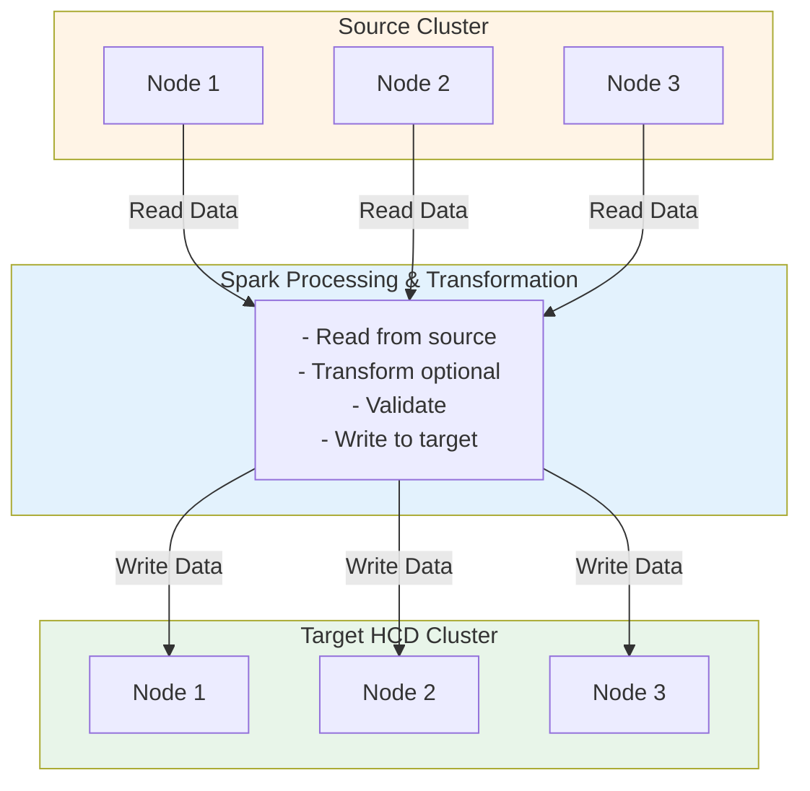

# Cassandra Data Migrator (CDM) Approach

## Table of Contents
1. [Overview](#overview)
2. [Architecture](#architecture)
3. [Installation](#installation)
4. [Configuration](#configuration)
5. [Migration Strategies](#migration-strategies)
6. [Advanced Features](#advanced-features)
7. [Performance Tuning](#performance-tuning)
8. [Monitoring](#monitoring)
9. [Best Practices](#best-practices)
10. [Troubleshooting](#troubleshooting)

## Overview

Cassandra Data Migrator (CDM) is an Apache Spark-based tool designed for large-scale data migration and validation between Apache Cassandra®-based databases. It's particularly effective for bulk data migration and can be combined with other tools for zero-downtime scenarios.

> **Important:** To use CDM successfully, your origin and target clusters must be Cassandra-based databases with matching schemas.

### Key Features

✅ **Spark-Based**: Leverages Apache Spark for distributed processing  
✅ **High Performance**: Parallel processing across multiple workers  
✅ **Flexible**: Supports various migration scenarios  
✅ **Data Validation**: Built-in consistency checking  
✅ **Transformation**: Can transform data during migration  
✅ **Resumable**: Can resume interrupted migrations  
✅ **Open Source**: Community-driven development
✅ **Track Runs**: Monitor migration progress in target keyspace tables
✅ **Resumable Jobs**: Auto-rerun incomplete migrations
✅ **SSL Support**: Including custom cipher algorithms
✅ **Astra DB Support**: Automatic SCB download via DevOps API

### When to Use CDM

**Ideal For:**
- Large-scale data migrations (multi-TB datasets)
- Initial bulk data load before enabling dual-write
- Data transformation during migration
- Complex data validation requirements
- Scenarios where Spark infrastructure is available

**Not Ideal For:**
- Real-time synchronization (use ZDM instead)
- Small datasets (< 100GB, simpler tools suffice)
- Environments without Spark
- Scenarios requiring immediate consistency

## Architecture

### High-Level Architecture



### Component Details

#### 1. Spark Driver (CDM Application)
- Coordinates migration job
- Manages task distribution
- Collects metrics and logs
- Handles failures and retries

#### 2. Spark Workers
- Execute migration tasks in parallel
- Read from source cluster
- Write to target cluster
- Perform data validation

#### 3. Source Cluster
- Provides data to migrate
- Supports: Apache Cassandra®, DataStax Enterprise™, DataStax Astra DB™, Azure Cosmos Cassandra
- Remains operational during migration
- No modifications required

#### 4. Target Cluster
- Receives migrated data
- Schema must exist before migration
- Can be operational during migration
- Supports: Apache Cassandra®, DataStax Enterprise™, DataStax Astra DB™, Azure Cosmos Cassandra

## Installation

### Prerequisites

```bash
# Required software
- Apache Spark 3.5.x (tested with 3.5.7)
- Java 11 or higher
- Scala 2.13
- Hadoop 3.3
- Network connectivity to both clusters

# Recommended resources
- 4+ CPU cores per worker
- 16+ GB RAM per worker
- Fast network connection
```

### Method 1: Pre-built JAR

```bash
# Download latest CDM JAR (replace x.y.z with actual version)
curl -L0 https://github.com/datastax/cassandra-data-migrator/releases/download/x.y.z/cassandra-data-migrator-x.y.z.jar --output cassandra-data-migrator-x.y.z.jar

# Or download from packages area
# https://github.com/datastax/cassandra-data-migrator/packages/1832128

# Verify download
ls -lh cassandra-data-migrator-x.y.z.jar
```

### Method 2: Build from Source

```bash
# Clone repository
git clone https://github.com/datastax/cassandra-data-migrator.git
cd cassandra-data-migrator

# Build with Maven (requires Maven 3.9.x)
mvn clean package

# JAR location
ls -lh target/cassandra-data-migrator-*.jar
```

### Method 3: Docker

```bash
# Pull latest Docker image
docker pull datastax/cassandra-data-migrator:latest

# Run migration
docker run -v $(pwd)/config:/config \
  datastax/cassandra-data-migrator:latest \
  --conf /config/cdm.properties
```

> **Note:** For Spark Cluster deployments, replace `--master "local[*]"` with `--master "spark://master-host:port"` and remove single-VM parameters like `--driver-memory` and `--executor-memory`.

## Configuration

### Basic Configuration

```properties
# cdm.properties
# Note: This file can have any name, not necessarily "cdm.properties"

# Spark configuration
spark.master=local[*]
spark.app.name=CDM-Migration

# Source cluster (Cassandra or DSE)
spark.origin.host=dse-node1,dse-node2,dse-node3
spark.origin.port=9042
spark.origin.username=cassandra
spark.origin.password=cassandra
spark.origin.keyspace=myapp
spark.origin.table=users

# Target cluster (HCD)
spark.target.host=hcd-node1,hcd-node2,hcd-node3
spark.target.port=9042
spark.target.username=cassandra
spark.target.password=cassandra
spark.target.keyspace=myapp
spark.target.table=users

# Migration settings
spark.cdm.schema.origin.column.names.to.target=*
spark.cdm.perfops.numParts=5000
spark.cdm.perfops.batchSize=5
```

### Advanced Configuration

```properties
# cdm-advanced.properties

# Spark configuration
spark.master=spark://spark-master:7077
spark.app.name=CDM-Production-Migration
spark.executor.instances=10
spark.executor.cores=4
spark.executor.memory=16g
spark.driver.memory=8g

# Source cluster (Cassandra or DSE)
spark.origin.host=dse-node1,dse-node2,dse-node3
spark.origin.port=9042
spark.origin.username=cassandra
spark.origin.password=cassandra
spark.origin.keyspace=myapp
spark.origin.table=users
spark.origin.connection.localDC=dc1
spark.origin.connection.consistency=LOCAL_QUORUM

# Target cluster (HCD)
spark.target.host=hcd-node1,hcd-node2,hcd-node3
spark.target.port=9042
spark.target.username=cassandra
spark.target.password=cassandra
spark.target.keyspace=myapp
spark.target.table=users
spark.target.connection.localDC=datacenter1
spark.target.connection.consistency=LOCAL_QUORUM

# Performance tuning
spark.cdm.perfops.numParts=5000
spark.cdm.perfops.batchSize=5
spark.cdm.perfops.fetchSizeInRows=1000
spark.cdm.perfops.ratelimit.origin=20000
spark.cdm.perfops.ratelimit.target=20000

# Data validation
spark.cdm.autocorrect.missing=true
spark.cdm.autocorrect.mismatch=true

# Error handling
spark.cdm.perfops.errorLimit=1000

# Filtering
spark.cdm.filter.cassandra.partition.min=0
spark.cdm.filter.cassandra.partition.max=100
```

### SSL Configuration

```properties
# cdm-ssl.properties

# Source SSL
spark.origin.connection.ssl.enabled=true
spark.origin.connection.ssl.truststore.path=/path/to/origin-truststore.jks
spark.origin.connection.ssl.truststore.password=truststore_password
spark.origin.connection.ssl.keystore.path=/path/to/origin-keystore.jks
spark.origin.connection.ssl.keystore.password=keystore_password

# Target SSL
spark.target.connection.ssl.enabled=true
spark.target.connection.ssl.truststore.path=/path/to/target-truststore.jks
spark.target.connection.ssl.truststore.password=truststore_password
spark.target.connection.ssl.keystore.path=/path/to/target-keystore.jks
spark.target.connection.ssl.keystore.password=keystore_password
```

## Migration Strategies

### Strategy 1: Full Table Migration

```bash
# Basic full table migration
spark-submit --properties-file cdm.properties \
  --conf spark.cdm.schema.origin.keyspaceTable="myapp.users" \
  --master "local[*]" --driver-memory 25G --executor-memory 25G \
  --class com.datastax.cdm.job.Migrate cassandra-data-migrator-x.y.z.jar &> logfile_name_$(date +%Y%m%d_%H_%M).txt
```

### Strategy 2: Partition Range Migration

```properties
# Migrate specific partition range
spark.cdm.filter.cassandra.partition.min=0
spark.cdm.filter.cassandra.partition.max=25

# Run multiple jobs in parallel for different ranges
# Job 1: 0-25
# Job 2: 26-50
# Job 3: 51-75
# Job 4: 76-100
```

```bash
# Run parallel migrations
for range in "0-25" "26-50" "51-75" "76-100"; do
  MIN=$(echo $range | cut -d'-' -f1)
  MAX=$(echo $range | cut -d'-' -f2)
  
  spark-submit --properties-file cdm.properties \
    --conf spark.cdm.schema.origin.keyspaceTable="myapp.users" \
    --conf spark.cdm.filter.cassandra.partition.min=$MIN \
    --conf spark.cdm.filter.cassandra.partition.max=$MAX \
    --master "local[*]" --driver-memory 25G --executor-memory 25G \
    --class com.datastax.cdm.job.Migrate cassandra-data-migrator-x.y.z.jar &
done
wait
```

### Strategy 3: Incremental Migration

```properties
# First run: Full migration
spark.cdm.feature.writetime.enabled=true

# Subsequent runs: Only new/updated data
spark.cdm.feature.writetime.enabled=true
spark.cdm.feature.writetime.filter.min=1708099200000000  # Timestamp in microseconds
```

> **Note:** Always enable writetime preservation to maintain chronological write history.

### Strategy 4: Column Subset Migration

```properties
# Migrate only specific columns
spark.cdm.schema.origin.column.names.to.target=user_id,username,email,created_at

# Exclude columns
spark.cdm.schema.origin.column.names.to.exclude=internal_field,deprecated_column
```

### Strategy 5: Data Transformation

```properties
# Enable transformation
spark.cdm.transform.custom.class=com.example.MyTransformer

# Custom transformer implementation
# Implement: com.datastax.cdm.feature.Transformer interface
```

## Advanced Features

### 1. Data Validation

```properties
# Enable AutoCorrect validation
spark.cdm.autocorrect.missing=true
spark.cdm.autocorrect.mismatch=true
spark.cdm.autocorrect.missing.counter=false  # Set to true for counter tables

# Validation modes:
# - autocorrect.missing: Add missing records from origin to target
# - autocorrect.mismatch: Reconcile mismatched records (origin overwrites target)
# - autocorrect.missing.counter: Enable for counter tables (default: false)
```

> **Important:** The validation job will never delete records from target - it only adds or updates data.

> **Important:** For `autocorrect.mismatch`, if the writetime of the origin record is before the target record's writetime, the original write won't appear in the target cluster due to last-write-wins semantics.

```bash
# Run validation-only job
spark-submit --properties-file cdm.properties \
  --conf spark.cdm.schema.origin.keyspaceTable="myapp.users" \
  --master "local[*]" --driver-memory 25G --executor-memory 25G \
  --class com.datastax.cdm.job.DiffData cassandra-data-migrator-x.y.z.jar &> logfile_name_$(date +%Y%m%d_%H_%M).txt
```

### 2. Guardrails

```properties
# Set guardrails to prevent issues
spark.cdm.guardrail.colSizeInKB=1024
spark.cdm.guardrail.rowSizeInKB=10240

# Rows exceeding guardrails are logged but not migrated
```

### 3. TTL and Writetime Preservation

```properties
# Preserve TTL
spark.cdm.feature.ttl.enabled=true

# Preserve writetime
spark.cdm.feature.writetime.enabled=true

# Both are critical for accurate migration
```

### 4. Counter Table Support

```properties
# Enable counter table migration
spark.cdm.feature.counter.enabled=true

# For validation with AutoCorrect on counter tables
spark.cdm.autocorrect.missing.counter=true

# Counter tables require special handling
```

### 5. Large Field Handling

```properties
# Handle large fields (blobs, text)
spark.cdm.feature.largefield.enabled=true
spark.cdm.feature.largefield.sizeInKB=1024
```

### 6. Run Tracking

```properties
# Enable run tracking (stores metrics in target keyspace)
spark.cdm.trackRun=true

# Auto-rerun previous incomplete job
spark.cdm.trackRun.autoRerun=true

# Or rerun a specific previous job
spark.cdm.trackRun.previousRunId=<prev_run_id>
```

> **Note:** Run information is stored in tables `cdm_run_info` and `cdm_run_details` in the target keyspace.

### 7. Guardrail Checks

```bash
# Check for large fields that may violate cluster guardrails
spark-submit --properties-file cdm.properties \
  --conf spark.cdm.schema.origin.keyspaceTable="myapp.users" \
  --conf spark.cdm.feature.guardrail.colSizeInKB=10000 \
  --master "local[*]" --driver-memory 25G --executor-memory 25G \
  --class com.datastax.cdm.job.GuardrailCheck cassandra-data-migrator-x.y.z.jar &> logfile_name_$(date +%Y%m%d_%H_%M).txt
```

> **Note:** Guardrail check mode only operates on origin cluster, there is no target in this mode.

## Performance Tuning

### Important Performance Notes

> **Performance Bottlenecks:**
> - Low resource availability on Origin or Target cluster
> - Low resource availability on CDM VMs
> - Bad schema design (unbalanced cluster, large partitions >100MB, large rows >10MB, high column count)

> **Key Configuration Impact:**
> - `numParts`: Default 5K, ideal is usually table-size/10MB
> - `batchSize`: Default 5, use 1 for large rows (>20KB) or when PK=partition key
> - `fetchSizeInRows`: Default 1K, reduce for tables with large rows (>100KB)
> - `ratelimit`: Default 20000, adjust to highest value clusters can handle

> **Performance Impact:**
> - Schema manipulation features (constantColumns, explodeMap, extractJson) may reduce performance
> - Transformation functions and where-filter conditions (except partition min/max) may reduce performance

### 1. Parallelism

```properties
# Increase parallelism
spark.cdm.perfops.numParts=5000  # Default is 5000, ideal is usually table-size/10MB

# Spark executor configuration
spark.executor.instances=20
spark.executor.cores=4
spark.executor.memory=16g
```

### 2. Batch Size

```properties
# Optimize batch size
spark.cdm.perfops.batchSize=10  # Rows per batch
spark.cdm.perfops.fetchSizeInRows=1000  # Fetch size from source
```

### 3. Rate Limiting

```properties
# Prevent overwhelming clusters
spark.cdm.perfops.ratelimit.origin=20000  # Reads per second
spark.cdm.perfops.ratelimit.target=20000  # Writes per second
```

### 4. Connection Pooling

```properties
# Optimize connections
spark.origin.connection.connections_per_executor_max=8
spark.target.connection.connections_per_executor_max=8
```

### 5. Memory Management

```bash
# Increase driver and executor memory
spark-submit --properties-file cdm.properties \
  --conf spark.cdm.schema.origin.keyspaceTable="myapp.users" \
  --master "local[*]" \
  --driver-memory 16g \
  --executor-memory 32g \
  --conf spark.memory.fraction=0.8 \
  --conf spark.memory.storageFraction=0.3 \
  --class com.datastax.cdm.job.Migrate cassandra-data-migrator-x.y.z.jar &> logfile_name_$(date +%Y%m%d_%H_%M).txt
```

## Monitoring

### Spark UI

```bash
# Access Spark UI
http://spark-master:4040

# Key metrics:
# - Active jobs
# - Completed stages
# - Task duration
# - Executor metrics
# - Storage memory
```

### CDM Metrics

```bash
# CDM logs show progress
# Example output:
[INFO] Migration progress: 1000000 rows processed
[INFO] Read rate: 50000 rows/sec
[INFO] Write rate: 45000 rows/sec
[INFO] Errors: 0
[INFO] Estimated completion: 2 hours
```

### Custom Monitoring Script

```bash
#!/bin/bash
# monitor_cdm.sh

SPARK_MASTER="spark://spark-master:7077"
APP_NAME="CDM-Migration"

while true; do
  # Get application status
  STATUS=$(curl -s http://spark-master:8080/json/ | \
    jq -r ".activeapps[] | select(.name==\"$APP_NAME\") | .state")
  
  if [ "$STATUS" == "RUNNING" ]; then
    echo "$(date): Migration in progress"
    
    # Get executor metrics
    curl -s http://spark-master:4040/api/v1/applications/$APP_ID/executors | \
      jq '.[] | {id, totalCores, memoryUsed, diskUsed}'
  else
    echo "$(date): Migration completed or not running"
    break
  fi
  
  sleep 60
done
```

### Validation Report

```bash
# After migration, check validation report
cat cdm-validation-report.txt

# Example report:
Total rows in source: 10000000
Total rows in target: 10000000
Missing rows: 0
Mismatched rows: 0
Migration status: SUCCESS
```

## Best Practices

### 1. Pre-Migration Preparation

```bash
# 1. Create schema on target
cqlsh hcd-node1 < schema.cql

# 2. Verify connectivity
cqlsh dse-node1 -e "SELECT * FROM myapp.users LIMIT 1;"
cqlsh hcd-node1 -e "SELECT * FROM myapp.users LIMIT 1;"

# 3. Test with small dataset
# Use partition range filter for testing
```

### 2. Staged Migration

```bash
# Stage 1: Migrate 10% of data
spark.cdm.filter.cassandra.partition.min=0
spark.cdm.filter.cassandra.partition.max=10

# Stage 2: Validate and tune
# Run validation job
# Adjust performance settings

# Stage 3: Migrate remaining data
spark.cdm.filter.cassandra.partition.min=11
spark.cdm.filter.cassandra.partition.max=100
```

### 3. Resource Allocation

```properties
# For 1TB dataset:
spark.executor.instances=20
spark.executor.cores=4
spark.executor.memory=16g
spark.cdm.perfops.numParts=5000  # Ideal: table-size/10MB

# Adjust based on:
# - Dataset size
# - Available resources
# - Network bandwidth
# - Cluster capacity
```

> **Note:** When running on a Spark Cluster, rate-limit values apply per worker node. Set to: effective-rate-limit/number-of-worker-nodes.

### 4. Error Handling

```properties
# Set error limits
spark.cdm.perfops.errorLimit=1000

# Log errors for review
spark.cdm.perfops.errorLog.enabled=true
spark.cdm.perfops.errorLog.path=/var/log/cdm/errors.log
```

### 5. Validation Strategy

```bash
# 1. Run migration
spark-submit ... Migrate ...

# 2. Run validation
spark-submit ... DiffData ...

# 3. Fix discrepancies
spark-submit ... Migrate ... (with autocorrect enabled)

# 4. Final validation
spark-submit ... DiffData ...
```

## Troubleshooting

### Issue 1: Out of Memory

```bash
# Symptoms
# - Executor failures
# - "OutOfMemoryError: Java heap space"

# Solutions
# 1. Increase executor memory
spark.executor.memory=32g

# 2. Reduce batch size
spark.cdm.perfops.batchSize=1  # Use 1 for large rows (>20KB) or when PK=partition key

# 3. Increase number of partitions
spark.cdm.perfops.numParts=10000
```

### Issue 2: Slow Migration

```bash
# Symptoms
# - Long migration time

# Solutions
# 1. Increase parallelism
spark.executor.instances=30
spark.cdm.perfops.numParts=10000

# 2. Optimize batch size
spark.cdm.perfops.batchSize=10

# 3. Check network bandwidth
# 4. Verify cluster health
```

### Issue 3: Connection Timeouts

```bash
# Symptoms
# - "Connection timeout"
# - "NoHostAvailableException"

# Solutions
# 1. Increase timeout
spark.origin.connection.timeout=30000
spark.target.connection.timeout=30000

# 2. Check network connectivity
# 3. Verify cluster health
# 4. Reduce rate limits
```

### Issue 4: Data Mismatches

```bash
# Symptoms
# - Validation reports mismatches
# - Different row counts

# Solutions
# 1. Enable autocorrect
spark.cdm.autocorrect.missing=true
spark.cdm.autocorrect.mismatch=true

# 2. Check TTL/writetime preservation
spark.cdm.feature.ttl.enabled=true
spark.cdm.feature.writetime.enabled=true

# 3. Verify schema compatibility
# 4. Check for ongoing writes to source
```

### Issue 5: Spark Job Failures

```bash
# Symptoms
# - Job fails with errors
# - Tasks keep retrying

# Solutions
# 1. Check Spark logs
tail -f /var/log/spark/spark-worker.log

# 2. Verify configuration
# 3. Check resource availability
# 4. Review error messages in Spark UI
```

## Complete Migration Example

```bash
#!/bin/bash
# complete_cdm_migration.sh

set -e

KEYSPACE="myapp"
TABLES=("users" "orders" "products")
CDM_JAR="cassandra-data-migrator-x.y.z.jar"
SPARK_MASTER="spark://spark-master:7077"

echo "Starting CDM migration"

for TABLE in "${TABLES[@]}"; do
  echo "Migrating table: $TABLE"
  
  # Create properties file
  cat > cdm-${TABLE}.properties << EOF
spark.master=$SPARK_MASTER
spark.app.name=CDM-${TABLE}
spark.executor.instances=10
spark.executor.cores=4
spark.executor.memory=16g

spark.origin.host=dse-node1,dse-node2,dse-node3
spark.origin.port=9042
spark.origin.username=cassandra
spark.origin.password=cassandra
spark.origin.keyspace=$KEYSPACE
spark.origin.table=$TABLE

spark.target.host=hcd-node1,hcd-node2,hcd-node3
spark.target.port=9042
spark.target.username=cassandra
spark.target.password=cassandra
spark.target.keyspace=$KEYSPACE
spark.target.table=$TABLE

spark.cdm.perfops.numParts=5000
spark.cdm.perfops.batchSize=10
spark.cdm.feature.ttl.enabled=true
spark.cdm.feature.writetime.enabled=true
EOF
  
  # Run migration
  spark-submit \
    --class com.datastax.cdm.job.Migrate \
    --master $SPARK_MASTER \
    $CDM_JAR \
    --properties-file cdm-${TABLE}.properties
  
  # Validate
  echo "Validating table: $TABLE"
  spark-submit \
    --class com.datastax.cdm.job.DiffData \
    --master $SPARK_MASTER \
    $CDM_JAR \
    --properties-file cdm-${TABLE}.properties
  
  echo "Table $TABLE migration complete"
done

echo "All tables migrated successfully"
```

## Important Limitations and Behaviors

### TTL and Writetime Handling
- CDM does not migrate TTL & writetime at field-level (for optimization)
- It finds the field with highest TTL & highest writetime within an origin row and uses those for the entire target row
- CDM ignores collection and UDT fields for TTL & writetime calculations by default
- Set `spark.cdm.schema.ttlwritetime.calc.useCollections=true` to include collections/UDTs (may impact performance)

### Data Handling
- CDM uses `UNSET` value for null fields (including empty texts) to avoid creating tombstones
- When running multiple times on same table, may create duplicate entries in `list` columns due to [Cassandra bug CASSANDRA-11368](https://issues.apache.org/jira/browse/CASSANDRA-11368)
- Use `spark.cdm.transform.custom.writetime.incrementBy` with positive value to address list duplication

### Last-Write-Wins with ZDM Proxy
When using CDM with ZDM Proxy, Cassandra's last-write-wins semantics ensure new, real-time writes take precedence over historical writes. The system compares `writetime` of conflicting records and retains the most recent write.

**Example:** If a new write occurs in target with writetime `2023-10-01T12:05:00Z`, and CDM migrates a record with writetime `2023-10-01T12:00:00Z`, the target retains the newer write.

### Run Metrics
- When rerunning to resume from previous run, metrics in `cdm_run_info` are only for current run
- If previous run was killed, its metrics may not be saved
- If previous run completed with errors, all run metrics from previous run are available

## Summary

CDM provides powerful capabilities for large-scale data migration:

**Advantages:**
- ✅ High performance with Spark
- ✅ Parallel processing
- ✅ Built-in validation
- ✅ Data transformation support
- ✅ Resumable migrations
- ✅ Open source

**Considerations:**
- Requires Spark infrastructure
- Not real-time (batch processing)
- Learning curve for Spark
- Resource intensive

**Best For:**
- Large datasets (multi-TB)
- Initial bulk data load
- Complex transformations
- Environments with Spark

**Combine With:**
- ZDM for real-time sync after bulk load
- Native tools for schema migration
- Custom validation scripts

---

**Next:** [Zero Downtime Migration (ZDM) Proxy Approach](05-zdm-approach.md)