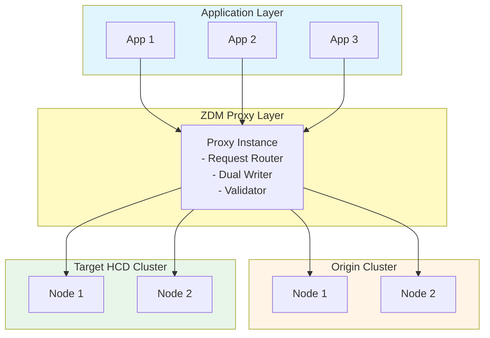

# Zero Downtime Migration (ZDM) Proxy Approach

## Table of Contents
1. [Overview](#overview)
2. [Architecture](#architecture)
3. [How ZDM Works](#how-zdm-works)
4. [Installation and Setup](#installation-and-setup)
5. [Configuration](#configuration)
6. [Migration Phases](#migration-phases)
7. [Monitoring and Validation](#monitoring-and-validation)
8. [Best Practices](#best-practices)
9. [Troubleshooting](#troubleshooting)

## Overview

The Zero Downtime Migration (ZDM) process enables your applications to continue running while you migrate data from one Cassandra-based database to another, resulting in little or no downtime and minimal service interruptions. The ZDM process uses ZDM Proxy, ZDM Utility, and ZDM Proxy Automation to orchestrate live reads and writes on your databases while you move and validate data with a data migration tool, such as Cassandra Data Migrator (CDM), DSBulk Loader, or Astra DB Sideloader.

> **Important:** To successfully migrate with ZDM Proxy, a read or write request produced by your client application must be able to succeed *without modification* on both your origin (existing) and target (new) clusters. This means that the origin and target clusters must have matching schemas, including keyspace names, table names, column names, and data types.

### Key Features

✅ **True Zero Downtime**: Applications remain operational throughout migration  
✅ **No Application Changes**: Transparent proxy layer  
✅ **Dual-Write Capability**: Writes to both clusters simultaneously  
✅ **Read Routing**: Intelligent read request routing  
✅ **Built-in Validation**: Automatic data consistency checks  
✅ **Gradual Migration**: Phase-based approach with rollback capability  
✅ **Monitoring**: Comprehensive metrics and logging

### When to Use ZDM

**Ideal For:**
- Production environments requiring zero downtime
- Applications that cannot be modified
- Large-scale migrations (multi-TB datasets)
- Complex multi-datacenter topologies
- Strict SLA requirements

**Not Ideal For:**
- Development/test environments (simpler tools suffice)
- Applications with very low latency requirements (proxy adds overhead)
- Scenarios where application changes are acceptable

## Architecture

### High-Level Architecture



### Component Details

#### 1. ZDM Proxy
- **Request Router**: Directs reads to appropriate cluster
- **Dual Writer**: Writes to both clusters simultaneously
- **Consistency Checker**: Validates data consistency
- **Metrics Collector**: Gathers performance metrics

#### 2. Origin Cluster (Source)
- Source cluster with existing data
- Supports: Apache Cassandra 3.11/4.0/4.1 or DSE 5.1/6.8/6.9
- Continues serving traffic during migration
- Gradually phased out

#### 3. Target Cluster (HCD)
- Destination cluster
- Receives dual-writes during migration
- Eventually becomes primary cluster

## How ZDM Proxy Works

ZDM Proxy keeps your databases in sync at all times through its dual-writes feature, which means you can seamlessly stop or abandon the migration at any point before the last phase (the final cutover to the new database).

### Dual-Write Mechanism

When ZDM Proxy is deployed and connected:
- **Writes**: Sent to both origin and target clusters simultaneously
- **Reads**: Initially from origin only, gradually shifted to target
- **Consistency**: Last-write-wins semantics ensure data consistency
- **Rollback**: Can rollback at any point before final cutover

### Read Routing Modes

ZDM Proxy supports three read routing modes:
- `PRIMARY_ONLY`: Reads from primary cluster only (origin or target)
- `DUAL`: Asynchronous dual reads for testing target performance
- `TARGET_ONLY`: All reads from target cluster

## Installation and Setup

### Prerequisites

```bash
# System requirements
- Java 11 or higher
- Network connectivity to both clusters
- Sufficient CPU and memory (4 cores, 8GB RAM minimum)
- Docker (optional, for containerized deployment)
```

### Installation Methods

#### Method 1: Binary Installation

```bash
# Download ZDM Proxy
wget https://github.com/datastax/zdm-proxy/releases/download/v2.1.0/zdm-proxy-2.1.0.tar.gz

# Extract
tar -xzf zdm-proxy-2.1.0.tar.gz
cd zdm-proxy-2.1.0

# Verify Java
java -version
# openjdk version "11.0.x"

# Run proxy
./bin/zdm-proxy --config config.yml
```

#### Method 2: Docker Installation

```bash
# Pull Docker image
docker pull datastax/zdm-proxy:2.1.0

# Run container
docker run -d \
  --name zdm-proxy \
  -p 9042:9042 \
  -p 14001:14001 \
  -v $(pwd)/config.yml:/config.yml \
  datastax/zdm-proxy:2.1.0 \
  --config /config.yml
```

#### Method 3: Kubernetes Deployment

```yaml
# zdm-proxy-deployment.yaml
apiVersion: apps/v1
kind: Deployment
metadata:
  name: zdm-proxy
spec:
  replicas: 3
  selector:
    matchLabels:
      app: zdm-proxy
  template:
    metadata:
      labels:
        app: zdm-proxy
    spec:
      containers:
      - name: zdm-proxy
        image: datastax/zdm-proxy:2.1.0
        ports:
        - containerPort: 9042
          name: cql
        - containerPort: 14001
          name: metrics
        volumeMounts:
        - name: config
          mountPath: /config.yml
          subPath: config.yml
        resources:
          requests:
            memory: "4Gi"
            cpu: "2"
          limits:
            memory: "8Gi"
            cpu: "4"
      volumes:
      - name: config
        configMap:
          name: zdm-proxy-config
---
apiVersion: v1
kind: Service
metadata:
  name: zdm-proxy
spec:
  selector:
    app: zdm-proxy
  ports:
  - port: 9042
    targetPort: 9042
    name: cql
  - port: 14001
    targetPort: 14001
    name: metrics
  type: LoadBalancer
```

## Configuration

### Basic Configuration

```yaml
# config.yml
origin_contact_points: "dse-node1,dse-node2,dse-node3"
origin_port: 9042
origin_username: "cassandra"
origin_password: "cassandra"

target_contact_points: "hcd-node1,hcd-node2,hcd-node3"
target_port: 9042
target_username: "cassandra"
target_password: "cassandra"

proxy_listen_port: 9042
proxy_listen_address: "0.0.0.0"

# Metrics endpoint
metrics_enabled: true
metrics_port: 14001
```

### Advanced Configuration

```yaml
# config.yml - Production settings
origin_contact_points: "dse-node1,dse-node2,dse-node3"
origin_port: 9042
origin_username: "cassandra"
origin_password: "cassandra"
origin_local_datacenter: "dc1"
origin_connection_timeout_ms: 5000
origin_request_timeout_ms: 12000

target_contact_points: "hcd-node1,hcd-node2,hcd-node3"
target_port: 9042
target_username: "cassandra"
target_password: "cassandra"
target_local_datacenter: "datacenter1"
target_connection_timeout_ms: 5000
target_request_timeout_ms: 12000

proxy_listen_port: 9042
proxy_listen_address: "0.0.0.0"
proxy_max_client_connections: 1000
proxy_max_stream_ids: 2048

# Read routing configuration
read_mode: "PRIMARY_ONLY"  # Options: PRIMARY_ONLY, DUAL, TARGET_ONLY
primary_cluster: "ORIGIN"  # Options: ORIGIN, TARGET

# Write configuration
async_handshake_timeout_ms: 4000
forward_client_credentials_to_origin: false
forward_client_credentials_to_target: false

# Metrics and monitoring
metrics_enabled: true
metrics_port: 14001
metrics_prefix: "zdm"

# Logging
log_level: "INFO"  # Options: TRACE, DEBUG, INFO, WARN, ERROR
```

### SSL/TLS Configuration

```yaml
# config.yml - With SSL
origin_contact_points: "dse-node1,dse-node2,dse-node3"
origin_port: 9042
origin_username: "cassandra"
origin_password: "cassandra"
origin_ssl_enabled: true
origin_ssl_truststore_path: "/path/to/origin-truststore.jks"
origin_ssl_truststore_password: "truststore_password"

target_contact_points: "hcd-node1,hcd-node2,hcd-node3"
target_port: 9042
target_username: "cassandra"
target_password: "cassandra"
target_ssl_enabled: true
target_ssl_truststore_path: "/path/to/target-truststore.jks"
target_ssl_truststore_password: "truststore_password"

# Client-facing SSL
proxy_ssl_enabled: true
proxy_ssl_keystore_path: "/path/to/proxy-keystore.jks"
proxy_ssl_keystore_password: "keystore_password"
```

## Migration Phases

A migration project includes preparation and five migration phases. The following sections describe the major events in each phase.

### Preparation: Plan and Prepare

Before beginning the migration, your client applications perform read/write operations directly with your existing CQL-compatible database (origin cluster).

**Key Activities:**

1. **Review Compatibility Requirements**
   - Ensure clusters, data model, and application logic are compatible with ZDM Proxy
   - Verify matching schemas between origin and target (keyspace names, table names, column names, data types)
   - Adjust data model or application logic as needed

2. **Prepare Infrastructure**
   ```bash
   # Set up target cluster
   # Create matching schemas on target
   cqlsh target-node1 < schema.cql
   
   # Verify schema compatibility
   cqlsh origin-node1 -e "DESCRIBE KEYSPACE myapp;"
   cqlsh target-node1 -e "DESCRIBE KEYSPACE myapp;"
   ```

3. **Deploy ZDM Proxy Infrastructure**
   ```bash
   # Deploy ZDM proxy instances
   docker run -d --name zdm-proxy \
     -p 9042:9042 \
     -p 14001:14001 \
     -v $(pwd)/config.yml:/config.yml \
     datastax/zdm-proxy:2.1.0 --config /config.yml
   ```

4. **Understand Rollback Options**
   - ZDM Proxy allows rollback at any point before Phase 5
   - Dual-write feature keeps clusters in sync
   - Plan rollback procedures

### Phase 1: Deploy ZDM Proxy and Connect Client Applications

In this phase, deploy ZDM Proxy instances and connect client applications to the proxies. This activates the dual-write logic: writes are sent to both origin and target databases, while reads are executed on the origin only.

```yaml
# config.yml - Phase 1
read_mode: "PRIMARY_ONLY"
primary_cluster: "ORIGIN"
```

**Key Activities:**

```bash
# 1. Update application connection strings
# FROM: origin-node1,origin-node2,origin-node3
# TO:   zdm-proxy-host

# 2. Restart applications gradually
# Monitor for errors and performance

# 3. Verify dual-write is working
cqlsh origin-node1 -e "SELECT COUNT(*) FROM myapp.users;"
cqlsh target-node1 -e "SELECT COUNT(*) FROM myapp.users;"

# 4. Monitor ZDM metrics
curl http://zdm-proxy-host:14001/metrics | grep write
```

**Expected Behavior:**
- All writes go to both clusters
- All reads come from origin cluster
- Asynchronous writes to target
- Origin response returned to application

### Phase 2: Migrate and Validate Data

In this phase, use a data migration tool to copy existing data to the target database. ZDM Proxy continues dual writes, so you can focus on migrating data that existed before ZDM Proxy was connected.

> **Production Recommendation:** Use **Cassandra Data Migrator (CDM)** for production backfill operations. CDM provides superior performance, built-in validation, resumability, and is specifically designed for large-scale migrations. DSBulk and Astra DB Sideloader are alternatives for smaller datasets or specific use cases.

**Key Activities:**

```bash
# 1. Use CDM for bulk data migration (RECOMMENDED FOR PRODUCTION)
spark-submit --properties-file cdm.properties \
  --conf spark.cdm.schema.origin.keyspaceTable="myapp.users" \
  --master "local[*]" --driver-memory 25G --executor-memory 25G \
  --class com.datastax.cdm.job.Migrate cassandra-data-migrator-x.y.z.jar

# 2. Validate migrated data with CDM
spark-submit --properties-file cdm.properties \
  --conf spark.cdm.schema.origin.keyspaceTable="myapp.users" \
  --master "local[*]" --driver-memory 25G --executor-memory 25G \
  --class com.datastax.cdm.job.DiffData cassandra-data-migrator-x.y.z.jar

# 3. Resolve missing and mismatched records
# Use CDM autocorrect features or manual reconciliation
```

**Why CDM for Production:**
- **Performance**: Spark-based parallel processing for multi-TB datasets
- **Validation**: Built-in DiffData job for consistency checking
- **Resumability**: Can resume interrupted migrations
- **TTL/Writetime Preservation**: Maintains data fidelity
- **Guardrails**: Prevents migration of oversized rows
- **AutoCorrect**: Automatically fixes missing/mismatched data

**Expected Behavior:**
- Historical data copied from origin to target
- ZDM Proxy continues dual-write for new data
- Thorough validation before proceeding

> **Important:** Do not proceed to Phase 3 until all data is validated and consistent between clusters.

### Phase 3: Enable Asynchronous Dual Reads (Optional but Recommended)

This phase is optional but recommended. Enable asynchronous dual reads to test the target database's ability to handle production workload before permanently switching applications.

```yaml
# config.yml - Phase 3
read_mode: "DUAL"
primary_cluster: "ORIGIN"
# Asynchronous reads sent to target for testing
```

**Key Activities:**

```bash
# 1. Enable async dual reads
# Update config and restart proxy

# 2. Monitor target performance
curl http://zdm-proxy-host:14001/metrics | grep read

# 3. Compare latency between clusters
# Check error rates on target
# Verify target can handle production load

# 4. Tune target cluster if needed
# Adjust resources, compaction, etc.
```

**Expected Behavior:**
- Synchronous reads from origin (primary)
- Asynchronous reads sent to target (secondary)
- Target performance tested without impacting applications
- Fallback to origin on target errors

### Phase 4: Route Reads to the Target Database

In this phase, switch read routing to the target database so all reads are executed on target. Writes are still sent to both databases in case rollback is needed.

```yaml
# config.yml - Phase 4
read_mode: "PRIMARY_ONLY"
primary_cluster: "TARGET"
```

**Key Activities:**

```bash
# 1. Switch primary cluster to target
# Update config and restart proxy

# 2. Monitor target cluster closely
curl http://zdm-proxy-host:14001/metrics

# 3. Verify application performance
# Check latency, error rates, throughput

# 4. Monitor for 24-48 hours
# Ensure stability before final cutover
```

**Expected Behavior:**
- All reads from target cluster
- All writes still go to both clusters
- Target is now the primary database
- Can still rollback if issues occur

> **Note:** At this point, the target database becomes the primary database, but rollback is still possible because dual-writes continue.

### Phase 5: Connect Directly to the Target Database (Final Cutover)

In the final phase, move client applications off ZDM Proxy and connect them directly to the target database. Once this happens, the migration is complete.

**Key Activities:**

```bash
# 1. Update application connection strings
# FROM: zdm-proxy-host
# TO:   target-node1,target-node2,target-node3

# 2. Restart applications gradually
# Monitor for issues

# 3. Verify all applications connected to target
# Check connection counts

# 4. Decommission ZDM Proxy (optional)
docker stop zdm-proxy
docker rm zdm-proxy

# 5. Backup and decommission origin cluster
nodetool snapshot -t final_backup
# Archive data per organizational policies
```

**Expected Behavior:**
- Applications connect directly to target
- No more dual-writes
- Origin cluster no longer synchronized
- Migration complete

> **Important:** After Phase 5, the origin database is no longer synchronized with the target database. The origin won't contain writes that happen after you disconnect ZDM Proxy. Whether you destroy or retain the origin database depends on your organization's policies.

## Monitoring and Validation

### Metrics Endpoint

```bash
# Access metrics
curl http://zdm-proxy-host:14001/metrics

# Key metrics to monitor:
# - zdm_proxy_requests_total
# - zdm_proxy_requests_duration_seconds
# - zdm_proxy_errors_total
# - zdm_proxy_origin_requests_total
# - zdm_proxy_target_requests_total
```

### Prometheus Integration

```yaml
# prometheus.yml
scrape_configs:
  - job_name: 'zdm-proxy'
    static_configs:
      - targets: ['zdm-proxy-host:14001']
    metrics_path: '/metrics'
    scrape_interval: 15s
```

### Grafana Dashboard

```json
{
  "dashboard": {
    "title": "ZDM Proxy Monitoring",
    "panels": [
      {
        "title": "Request Rate",
        "targets": [
          {
            "expr": "rate(zdm_proxy_requests_total[5m])"
          }
        ]
      },
      {
        "title": "Error Rate",
        "targets": [
          {
            "expr": "rate(zdm_proxy_errors_total[5m])"
          }
        ]
      },
      {
        "title": "Latency (p99)",
        "targets": [
          {
            "expr": "histogram_quantile(0.99, zdm_proxy_requests_duration_seconds_bucket)"
          }
        ]
      }
    ]
  }
}
```

### Data Consistency Validation

```bash
# validation_script.sh
#!/bin/bash

KEYSPACE="myapp"
TABLE="users"
SAMPLE_SIZE=1000

# Get random sample from origin
ORIGIN_SAMPLE=$(cqlsh dse-node1 -e "
  SELECT user_id, username, email 
  FROM $KEYSPACE.$TABLE 
  LIMIT $SAMPLE_SIZE
" | tail -n +4)

# Check same records on target
while IFS= read -r line; do
  USER_ID=$(echo $line | awk '{print $1}')
  
  ORIGIN_DATA=$(cqlsh dse-node1 -e "
    SELECT * FROM $KEYSPACE.$TABLE WHERE user_id = $USER_ID
  ")
  
  TARGET_DATA=$(cqlsh hcd-node1 -e "
    SELECT * FROM $KEYSPACE.$TABLE WHERE user_id = $USER_ID
  ")
  
  if [ "$ORIGIN_DATA" != "$TARGET_DATA" ]; then
    echo "Mismatch for user_id: $USER_ID"
  fi
done <<< "$ORIGIN_SAMPLE"

echo "Validation complete"
```

### Automated Validation Tool

```python
# validate_consistency.py
from cassandra.cluster import Cluster
import random

def validate_consistency(keyspace, table, sample_size=1000):
    # Connect to both clusters
    origin_cluster = Cluster(['dse-node1'])
    target_cluster = Cluster(['hcd-node1'])
    
    origin_session = origin_cluster.connect(keyspace)
    target_session = target_cluster.connect(keyspace)
    
    # Get sample from origin
    rows = origin_session.execute(f"SELECT * FROM {table} LIMIT {sample_size}")
    
    mismatches = 0
    for row in rows:
        # Build WHERE clause from primary key
        pk_columns = get_primary_key_columns(keyspace, table)
        where_clause = " AND ".join([f"{col} = %s" for col in pk_columns])
        pk_values = [getattr(row, col) for col in pk_columns]
        
        # Query target
        target_row = target_session.execute(
            f"SELECT * FROM {table} WHERE {where_clause}",
            pk_values
        ).one()
        
        # Compare
        if not rows_equal(row, target_row):
            mismatches += 1
            print(f"Mismatch: {pk_values}")
    
    print(f"Validation complete: {mismatches} mismatches out of {sample_size}")
    
    origin_cluster.shutdown()
    target_cluster.shutdown()

if __name__ == "__main__":
    validate_consistency("myapp", "users", 1000)
```

## Best Practices

### 1. Gradual Rollout

```bash
# Start with non-critical applications
# Monitor for issues
# Gradually add more applications
# Keep rollback plan ready
```

### 2. Performance Testing

```bash
# Baseline performance on origin
cassandra-stress write n=1000000 -node dse-node1

# Test through proxy
cassandra-stress write n=1000000 -node zdm-proxy-host

# Compare results
# Acceptable overhead: 5-10%
```

### 3. Capacity Planning

```yaml
# ZDM Proxy resources per 1000 req/sec:
CPU: 1 core
Memory: 2 GB
Network: 100 Mbps

# Scale horizontally as needed
# Deploy multiple proxy instances
# Use load balancer
```

### 4. High Availability

```bash
# Deploy multiple proxy instances
# Use load balancer (HAProxy, Nginx)
# Configure health checks
# Implement automatic failover
```

### 5. Monitoring Checklist

- [ ] Request rate (reads/writes per second)
- [ ] Error rate (< 0.1% acceptable)
- [ ] Latency (p50, p95, p99)
- [ ] Connection count
- [ ] Memory usage
- [ ] CPU usage
- [ ] Network usage
- [ ] Data consistency validation

## Troubleshooting

### Issue 1: High Latency

```bash
# Symptoms
# - Increased response times
# - Application timeouts

# Diagnosis
curl http://zdm-proxy-host:14001/metrics | grep duration

# Solutions
# 1. Increase proxy resources
# 2. Tune connection pools
# 3. Check network latency
# 4. Optimize queries
```

### Issue 2: Connection Errors

```bash
# Symptoms
# - "Connection refused"
# - "Too many connections"

# Diagnosis
netstat -an | grep 9042 | wc -l

# Solutions
# 1. Increase max_client_connections
# 2. Check firewall rules
# 3. Verify cluster health
# 4. Scale proxy instances
```

### Issue 3: Data Inconsistency

```bash
# Symptoms
# - Different row counts
# - Missing data on target

# Diagnosis
# Run consistency validation script

# Solutions
# 1. Check dual-write configuration
# 2. Verify replication settings
# 3. Run repair on target
# 4. Re-sync affected data
```

### Issue 4: Memory Issues

```bash
# Symptoms
# - OutOfMemoryError
# - Proxy crashes

# Diagnosis
docker stats zdm-proxy

# Solutions
# 1. Increase container memory
# 2. Tune JVM heap size
# 3. Reduce max_stream_ids
# 4. Check for memory leaks
```

## Summary

ZDM Proxy provides a robust solution for zero-downtime migration:

**Advantages:**
- ✅ True zero downtime
- ✅ No application changes required
- ✅ Built-in validation
- ✅ Gradual migration with rollback
- ✅ Production-ready

**Considerations:**
- Additional infrastructure required
- Proxy adds latency overhead (5-10%)
- Requires monitoring and management
- Learning curve for operations team

**Best For:**
- Production environments
- Large-scale migrations
- Strict SLA requirements
- Applications that cannot be modified

---

**Next:** [Tool Comparison and Decision Matrix](06-comparison-matrix.md)