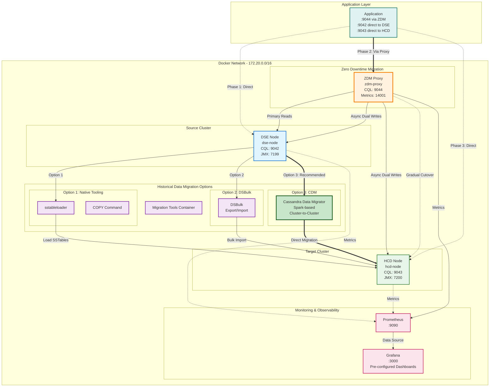

# Migration Lab Environment

## Overview

This lab environment provides a complete setup for practicing DSE to HCD migration with zero downtime. It includes:

- **DSE Cluster** (1 node) - Source cluster (supports DSE 5.1, 6.8, 6.9)
- **HCD Cluster** (1 node) - Target cluster using Cassandra 4.1
- **ZDM Proxy** - For zero-downtime migration
- **Migration Tools** - Pre-configured container with all tools
- **Monitoring** - Prometheus and Grafana for observability
- **Data Generator** - For creating test data

## Prerequisites

### Using Colima (macOS/Linux - Recommended)

#### For Apple Silicon (M1/M2/M3) - **IMPORTANT**

```bash
# Install Colima
brew install colima

# Start Colima with Rosetta 2 for full compatibility (including ZDM Proxy)
colima start --arch aarch64 --vm-type=vz --vz-rosetta --cpu 6 --memory 12 --disk 60

# Verify Colima is running with Rosetta 2
colima status
# Should show: vz-rosetta: true
```

**Why Rosetta 2?** ZDM Proxy requires x86_64 architecture. Rosetta 2 enables seamless emulation with minimal performance overhead (~5%). See [`ARM64-NOTES.md`](ARM64-NOTES.md) for details.

#### For Intel/AMD (x86_64)

```bash
# Install Colima
brew install colima

# Start Colima with sufficient resources
colima start --cpu 4 --memory 8 --disk 50

# Verify Colima is running
colima status
```

### Using Docker Desktop

Ensure Docker Desktop is configured with:
- **CPUs**: 4 or more
- **Memory**: 8GB or more
- **Disk**: 50GB or more

## Quick Start

### 1. Start the Lab Environment

```bash
# Navigate to lab directory
cd lab

# Start all services
docker-compose up -d

# This will start:
# - 1 DSE node
# - 1 HCD node
# - ZDM Proxy
# - Monitoring stack
# - Tools container
```

### 2. Wait for Clusters to Initialize

```bash
# Check status (this may take 3-5 minutes)
docker-compose ps

# Wait for all services to be healthy
watch -n 5 'docker-compose ps'

# Check DSE cluster status
docker exec dse-node nodetool status

# Check HCD cluster status
docker exec hcd-node nodetool status
```

### 3. Verify Connectivity

```bash
# Connect to DSE
docker exec -it dse-node cqlsh
# Should see: Connected to DSE_Cluster

# Connect to HCD
docker exec -it hcd-node cqlsh
# Should see: Connected to HCD_Cluster

# Exit cqlsh
exit
```

## Lab Architecture



### Architecture Components

#### 1. **Source Cluster (DSE)**
- Single DSE node running on port 9042
- Supports DSE 5.1, 6.8, 6.9 or Cassandra 3.11/4.0/4.1
- JMX monitoring on port 7199

#### 2. **Target Cluster (HCD)**
- Single HCD node (Cassandra 4.1) on port 9043
- Production-ready Cassandra distribution
- JMX monitoring on port 7200

#### 3. **Zero Downtime Migration (ZDM) Proxy**
- Transparent proxy on port 9044
- Dual-write capability to both clusters
- Gradual traffic cutover from source to target
- Metrics endpoint on port 14001

#### 4. **Historical Data Migration Options**

**Option 1: Native Tooling** (Basic)
- `sstableloader`: Load SSTables directly
- `COPY` command: CSV-based export/import
- Best for: Small datasets, simple schemas

**Option 2: DSBulk** (Intermediate)
- DataStax Bulk Loader
- Parallel export/import operations
- Best for: Medium datasets, better performance

**Option 3: Cassandra Data Migrator (CDM)** ⭐ **Recommended**
- Spark-based distributed migration
- Direct cluster-to-cluster transfer
- Built-in validation with DiffData
- Best for: Large datasets, production migrations

#### 5. **Application Integration**
- **Phase 1**: Direct connection to DSE (:9042)
- **Phase 2**: Connection via ZDM Proxy (:9044) with dual-writes
- **Phase 3**: Direct connection to HCD (:9043) after cutover

#### 6. **Monitoring & Observability**
- **Prometheus** (:9090): Metrics collection and storage
- **Grafana** (:3000): Pre-configured dashboards for ZDM, clusters, and system metrics

### Migration Flow

1. **Setup Phase**: Deploy all components in Docker network
2. **Historical Data Migration**: Use CDM (recommended) or other tools to migrate existing data
3. **ZDM Phase**: Route application through proxy for dual-writes
4. **Validation Phase**: Verify data consistency between clusters
5. **Cutover Phase**: Gradually shift reads to target cluster
6. **Completion**: Direct application to HCD, decommission DSE

## Port Mappings

| Service | Internal Port | External Port | Purpose |
|---------|--------------|---------------|---------|
| DSE Node 1 | 9042 | 9042 | CQL |
| DSE Node 1 | 7199 | 7199 | JMX |
| HCD Node 1 | 9042 | 9043 | CQL |
| HCD Node 1 | 7199 | 7200 | JMX |
| ZDM Proxy | 9042 | 9044 | CQL Proxy |
| ZDM Proxy | 14001 | 14001 | Metrics |
| Prometheus | 9090 | 9090 | Metrics UI |
| Grafana | 3000 | 3000 | Dashboard |

## Accessing Services

### CQL Access

```bash
# DSE Cluster
docker exec -it dse-node cqlsh

# HCD Cluster
docker exec -it hcd-node cqlsh

# Via ZDM Proxy (after configuration)
docker exec -it migration-tools cqlsh zdm-proxy 9042

# From host machine
cqlsh localhost 9042  # DSE
cqlsh localhost 9043  # HCD
cqlsh localhost 9044  # ZDM Proxy
```

### Monitoring

```bash
# Prometheus
open http://localhost:9090

# Grafana (with pre-configured ZDM dashboards)
open http://localhost:3000
# Username: admin
# Password: admin
# Navigate to: Dashboards → ZDM Migration folder
```

**Pre-configured Grafana Dashboards:**
- **ZDM Proxy Dashboard** - Monitor request rates, latencies, routing, and errors
- **ZDM Go Runtime Metrics** - Track memory, GC, and goroutine statistics
- **Node Exporter Full** - System-level metrics (requires node-exporter)

See [`monitoring/README.md`](monitoring/README.md) for detailed dashboard documentation.

### Tools Container

```bash
# Access tools container
docker exec -it migration-tools bash

# Available tools:
# - cqlsh
# - nodetool
# - sstableloader
# - dsbulk
# - Python with cassandra-driver
# - Various scripts
```

## Lab Exercises

The lab includes several hands-on exercises:

1. **[Exercise 1: Environment Setup](exercises/01-environment-setup.md)**
   - Verify cluster health
   - Create test schema
   - Generate sample data

2. **[Exercise 2: Native Tooling Migration](exercises/02-native-tooling.md)**
   - Use sstableloader
   - Use COPY command
   - Compare performance

3. **[Exercise 3: DSBulk Migration](exercises/03-dsbulk-migration.md)**
   - Export data with dsbulk
   - Import to HCD
   - Validate results

4. **[Exercise 4: Cassandra Data Migrator (CDM)](exercises/04-cdm-migration.md)** ⭐ NEW
   - Use pre-configured Spark with CDM
   - Perform cluster-to-cluster migration
   - Validate data with DiffData
   - Compare with DSBulk performance
   - Explore advanced features

5. **[Exercise 5: ZDM Proxy Migration](exercises/05-zdm-migration.md)**
   - Configure ZDM proxy
   - Enable dual-write
   - Gradual cutover

6. **[Exercise 6: Validation and Monitoring](exercises/06-validation-monitoring.md)**
   - Data consistency checks
   - Performance comparison
   - Monitoring setup

## Common Commands

### Cluster Management

```bash
# Check cluster status
docker exec dse-node nodetool status
docker exec hcd-node nodetool status

# View cluster info
docker exec dse-node nodetool info
docker exec hcd-node nodetool info

# Check compaction
docker exec dse-node nodetool compactionstats
docker exec hcd-node nodetool compactionstats

# View logs
docker logs dse-node
docker logs hcd-node
docker logs zdm-proxy
```

### Data Operations

```bash
# Create snapshot
docker exec dse-node nodetool snapshot myapp

# List snapshots
docker exec dse-node nodetool listsnapshots

# Clear snapshot
docker exec dse-node nodetool clearsnapshot -t snapshot_name

# Repair
docker exec dse-node nodetool repair myapp
```

### Container Management

```bash
# View all containers
docker-compose ps

# View logs
docker-compose logs -f [service_name]

# Restart service
docker-compose restart [service_name]

# Stop all services
docker-compose down

# Stop and remove volumes
docker-compose down -v
```

## Troubleshooting

### Containers Won't Start

```bash
# Check Docker resources
docker system df

# Check Colima resources (if using Colima)
colima status

# Increase resources
colima stop
colima start --cpu 6 --memory 12 --disk 60

# Check logs
docker-compose logs
```

### Clusters Not Forming

```bash
# Check network
docker network ls
docker network inspect lab_cassandra-migration

# Check if nodes can communicate
# (Single node setup - no inter-node communication needed)

# Restart cluster
docker-compose restart dse-node hcd-node
```

### Connection Issues

```bash
# Verify ports are listening
docker exec dse-node netstat -tlnp | grep 9042
docker exec hcd-node netstat -tlnp | grep 9042

# Check firewall (host machine)
# Ensure ports are not blocked

# Test connectivity
telnet localhost 9042
telnet localhost 9043
```

### Performance Issues

```bash
# Check resource usage
docker stats

# Reduce number of nodes if needed
# Edit docker-compose.yml to comment out node2 and node3

# Increase container resources
# Edit docker-compose.yml mem_limit and cpus values
```

### Out of Disk Space

```bash
# Check disk usage
docker system df

# Clean up unused resources
docker system prune -a

# Remove old volumes
docker volume prune

# For Colima
colima stop
rm -rf ~/.colima
colima start --cpu 4 --memory 8 --disk 60
```

## Cleanup

### Stop Lab Environment

```bash
# Stop all containers
docker-compose down

# Stop and remove volumes (WARNING: deletes all data)
docker-compose down -v
```

### Complete Cleanup

```bash
# Remove all lab resources
docker-compose down -v --rmi all

# Clean up Docker system
docker system prune -a --volumes

# Stop Colima (if using)
colima stop
```

## Tips and Best Practices

### Resource Management

1. **Start with minimal setup** - Use 1 node per cluster for initial testing
2. **Monitor resources** - Use `docker stats` to watch resource usage
3. **Scale gradually** - Add nodes as needed for specific exercises
4. **Clean up regularly** - Remove unused containers and volumes

### Working with the Lab

1. **Save your work** - Scripts and data in mounted volumes persist
2. **Use snapshots** - Create snapshots before risky operations
3. **Document findings** - Keep notes of what you learn
4. **Experiment safely** - Lab environment is disposable

### Performance Optimization

1. **Adjust heap sizes** - Modify MAX_HEAP_SIZE in docker-compose.yml
2. **Tune compaction** - Adjust compaction settings for faster operations
3. **Use SSD** - Ensure Docker/Colima uses SSD storage
4. **Limit logging** - Reduce log verbosity if needed

## Next Steps

1. Complete [Exercise 1: Environment Setup](exercises/01-environment-setup.md)
2. Review the [documentation](../docs/) for migration strategies
3. Practice different migration approaches
4. Experiment with monitoring and validation

## Support

For issues or questions:
- Check the [Troubleshooting Guide](../docs/08-troubleshooting.md)
- Review exercise documentation
- Check Docker/Colima logs
- Consult main README.md

## Lab Environment Specifications

### System Requirements

| Component | Minimum | Recommended |
|-----------|---------|-------------|
| CPU Cores | 4 | 6-8 |
| RAM | 8GB | 12-16GB |
| Disk Space | 30GB | 50GB+ |
| Network | 100Mbps | 1Gbps |

### Container Resources

| Container | CPU | Memory | Purpose |
|-----------|-----|--------|---------|
| DSE Nodes | 1.0 | 2GB | Source cluster |
| HCD Nodes | 1.0 | 2GB | Target cluster |
| ZDM Proxy | 0.5 | 1GB | Migration proxy |
| Tools | 1.0 | 2GB | Migration tools |
| Prometheus | 0.5 | 512MB | Metrics |
| Grafana | 0.5 | 512MB | Dashboards |

### Estimated Startup Time

- **Initial startup**: 5-10 minutes
- **Subsequent startups**: 2-3 minutes
- **Full cluster formation**: 3-5 minutes

## Version Information

- **Source**: DSE 5.1.35 (default) - configurable to Cassandra 3.11/4.0/4.1 or DSE 5.1.x/6.8.x/6.9.x
- **Target (HCD)**: Cassandra 4.1
- **ZDM Proxy**: 2.1.0
- **Docker Compose**: 3.8
- **Python**: 3.11

---

**Ready to start?** Begin with [Exercise 1: Environment Setup](exercises/01-environment-setup.md)